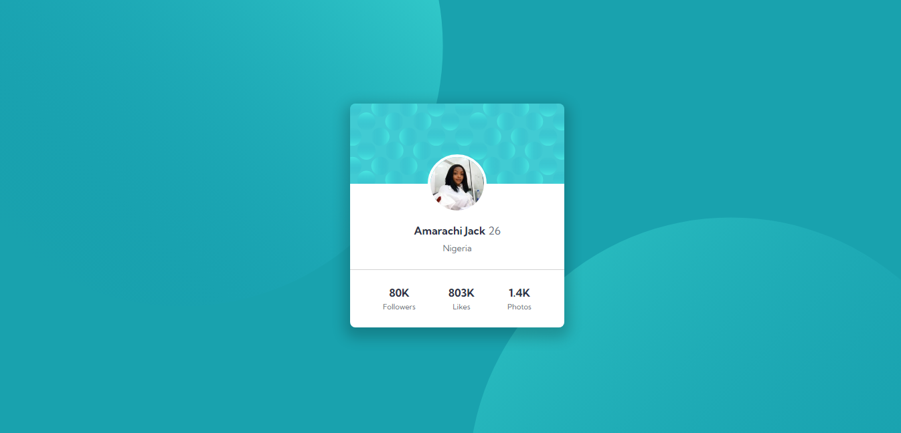
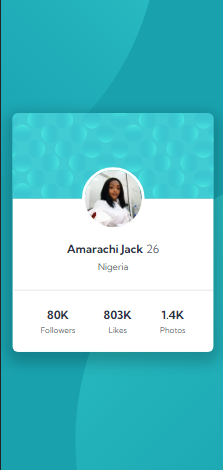

# Frontend Mentor - Profile card component solution

This is a solution to the [Profile card component challenge on Frontend Mentor](https://www.frontendmentor.io/challenges/profile-card-component-cfArpWshJ). Frontend Mentor challenges help you improve your coding skills by building realistic projects.

## Table of contents

- [Overview](#overview)
  - [The challenge](#the-challenge)
  - [Screenshot](#screenshot)
  - [Links](#links)
- [My process](#my-process)
  - [Built with](#built-with)
  - [What I learned](#what-i-learned)
  - [Continued development](#continued-development)
  - [Useful resources](#useful-resources)
- [Author](#author)
- [Acknowledgments](#acknowledgments)

## Overview

### The challenge

- Build out the project to the designs provided

### Screenshot





### Links

- Solution URL: https://github.com/Amarajack/profile-card
- Live Site URL: https://amarajack.github.io/profile-card/

## My process

### Built with

- Semantic HTML5 markup
- CSS custom properties
- Flexbox
- Mobile-first workflow

### What I learned

I learned how to add multiple backgrounds and the concept of background position.

```html
<div class="First-image">
	
</div>
```

```css
main {
	background-color: hsl(185, 75%, 39%);
	min-height: 100vh;
	background-image: url(./bg-pattern-top.svg), url(./bg-pattern-bottom.svg);
	background-position: -150px -400px, 120% -250%;
	background-repeat: no-repeat;
	display: flex;
	justify-content: center;
	align-items: center;
}
```

### Continued development

I would love to focus on the CSS styling part of different projects i intend to work on in the future.

### Useful resources

- [Example resource 1](https://www.w3schools.com/css/css3_backgrounds.asp) - This helped me when i wanted to create multiple backgrounds for my css styling. I really liked this pattern and will use it going forward.

## Author

- Frontend Mentor - [ @Amarajack](https://www.frontendmentor.io/profile/Amarajack)
- Twitter - [Amarachi Jack](https://www.linkedin.com/in/amarachi-jack-654680165)

## Acknowledgments

I want to appreciate my mentor @princessmaggy for her apts, explanatory coaching and encouragement during the process of my training. I'm so glad to have learned all that I have and I look forward to learning more. Thank you coach for your resilience.
